# Procesverslag
Markdown is een simpele manier om HTML te schrijven.  
Markdown cheat cheet: [Hulp bij het schrijven van Markdown](https://github.com/adam-p/markdown-here/wiki/Markdown-Cheatsheet).

Nb. De standaardstructuur en de spartaanse opmaak van de README.md zijn helemaal prima. Het gaat om de inhoud van je procesverslag. Besteedt de tijd voor pracht en praal aan je website.

Nb. Door *open* toe te voegen aan een *details* element kun je deze standaard open zetten. Fijn om dat steeds voor de relevante stuk(ken) te doen.

## Jij

  
uitwerken voor kick-off werkgroep

  ### Auteur:
  Sabrina Zuurbier

  #### Je startniveau:
  rode piste (kies uit zwart, rood óf blauw)

  #### Je focus:
  hier je focus (kies uit responsive óf surface plane)
  Mijn focus gaat denk ik meer zijn op het responsive gedeelte, maar om mijzelf een beetje uit te dagen met de code wil ik kijken/experimenteren of het lukt om een onderdeel uit de surface plane te kiezen.
 

## Je website

  
uitwerken voor kick-off werkgroep

  ### Je opdracht:
  link naar de website die je gaat namaken óf de naam/omschrijving van je eigen ontwerp
  De concerten website: Mojo
  Mojo link: https://www.mojo.nl/ 

  #### Screenshot(s) van de eerste pagina (small screen): 
  Homepagina van mojo (laptop)
  
  Homeoagina van mojo (telefoon)
 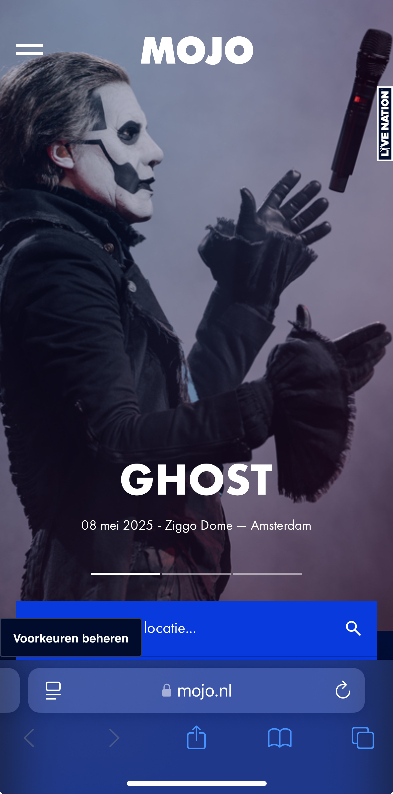

  #### Screenshot(s) van de tweede pagina (small screen):
Detailpagina het evenement (laptop)
 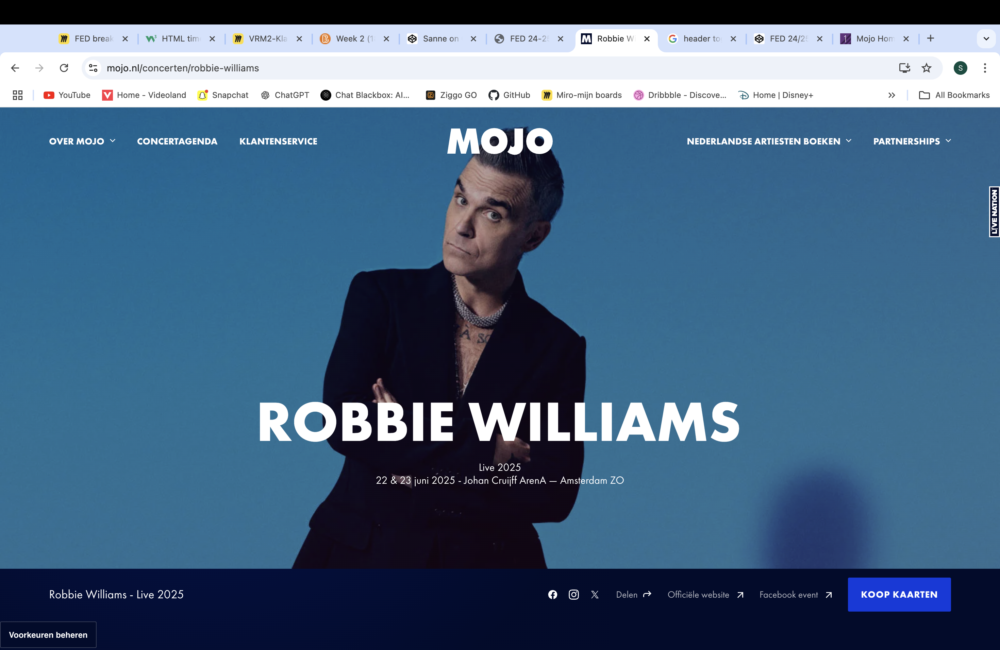 

 vanaf de telefoon
  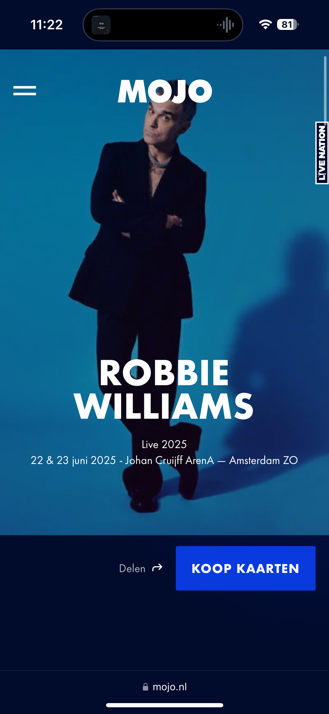 

## Toegankelijkheidstest 1/2 (week 1)

  
uitwerken na test in 2e werkgroep 2

  ### Bevindingen
 Bevindingen van crea de website van Maja: https://www.crea.nl/ 
 Bij een van de mogelijkheden bij november staan er pijltjes naar links en rechts die pakt hij helemaal niet.
 bij de dropdown menu krijg je geen optie om het te openen, na wat proberen moet je er alleen op enter klikken.
 Je moet wel weten wat level 3 heading betekent als je zo'n screenreader gebruikt.
 Je kan bij de evenementen krijg je niet de optie om erop te klikken, terwijl dit wel kan. Hij leest alleen de woorden voor.
 Hij benoemd de foto's niet.

 Bij mijn eigen site Mojo:
 -Soms slaat hij bepaalde dingen gewoon over. 
 -De ene keer pakt hij de images wel met de screenrecorder de andere keer niet.
 -Heel handig dat hij ook de tekst van de logo's voorleest. 
 -Wat praat het veel

 <bold> WCAG checklist </bold>
 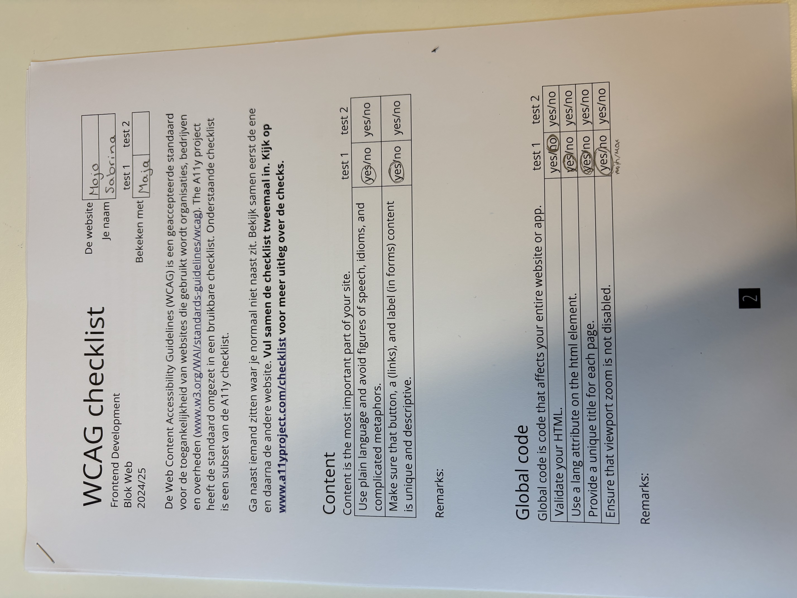
  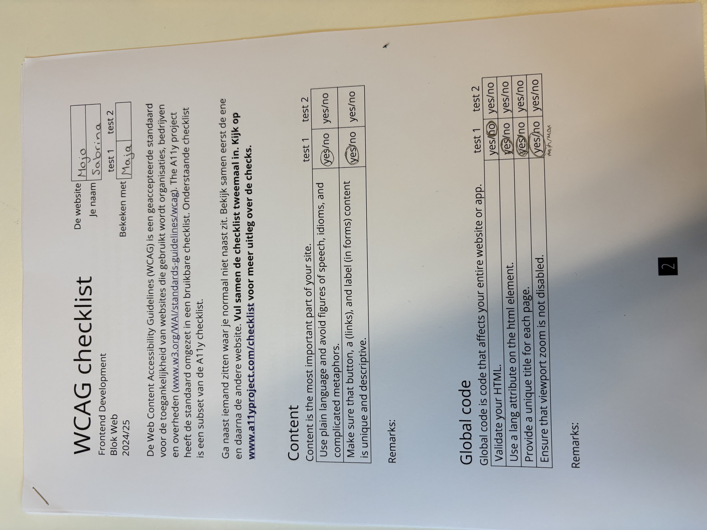
  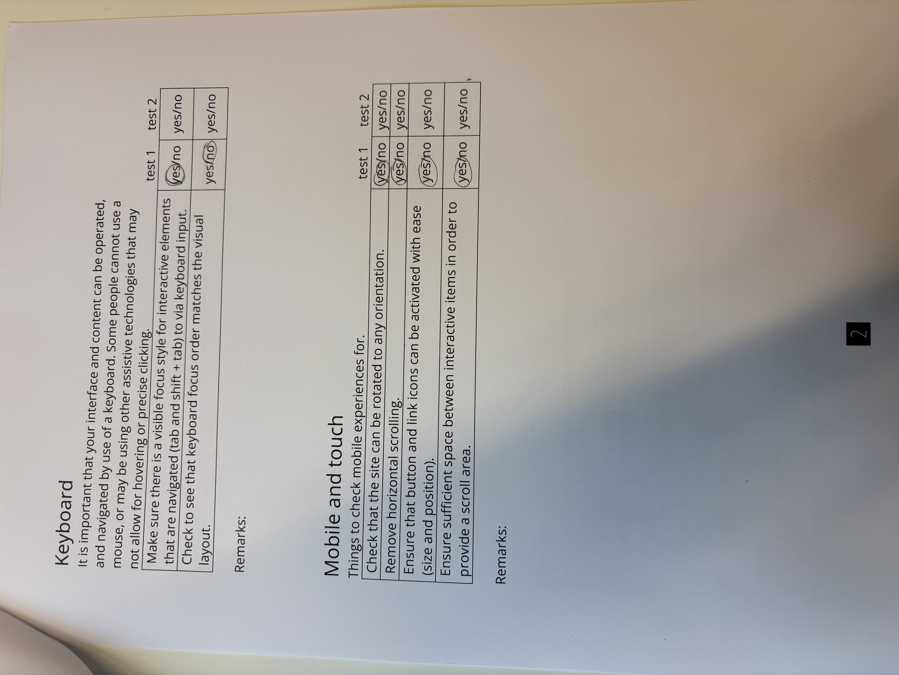
  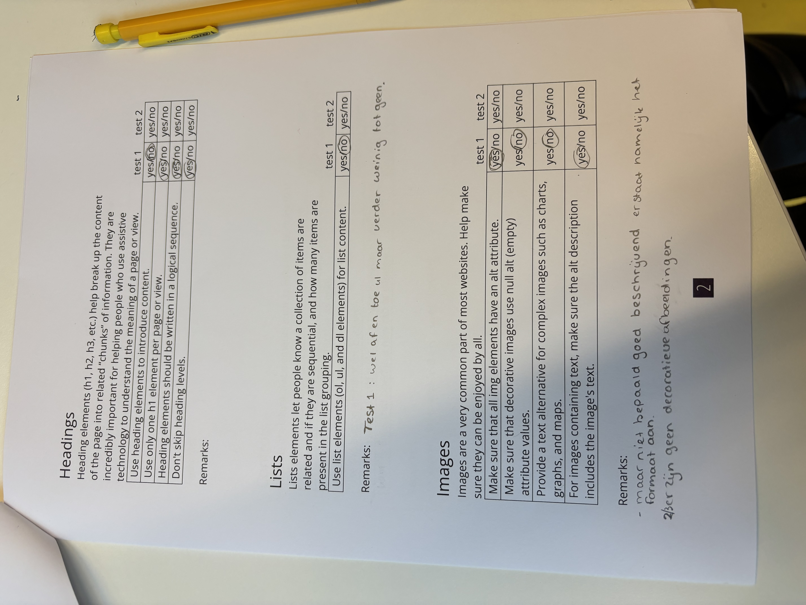
   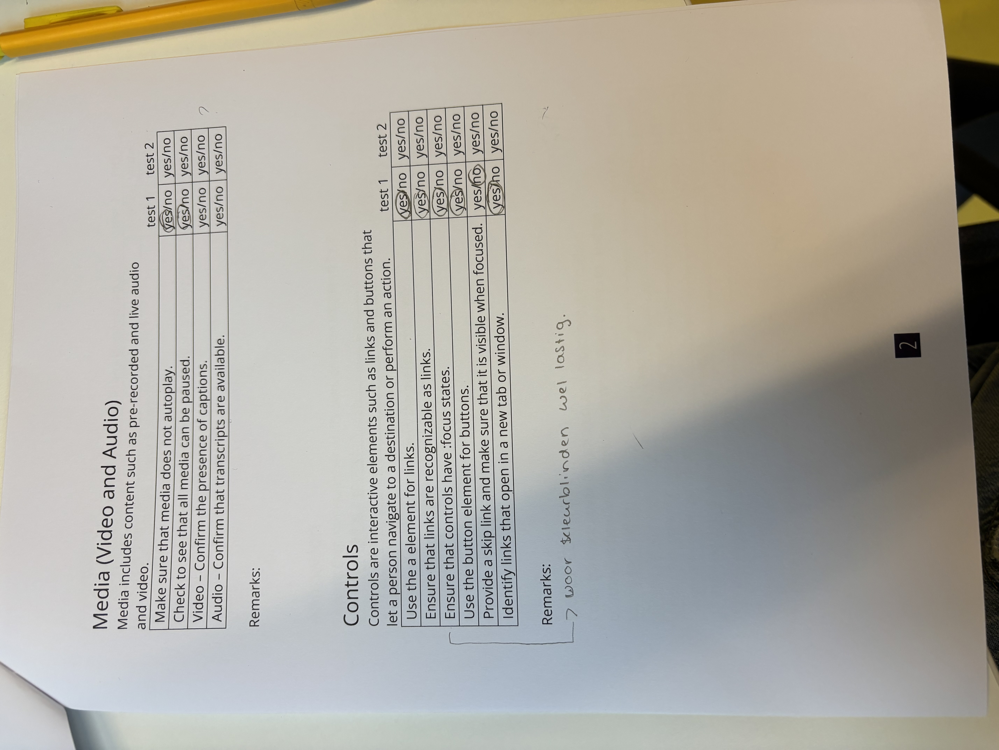
  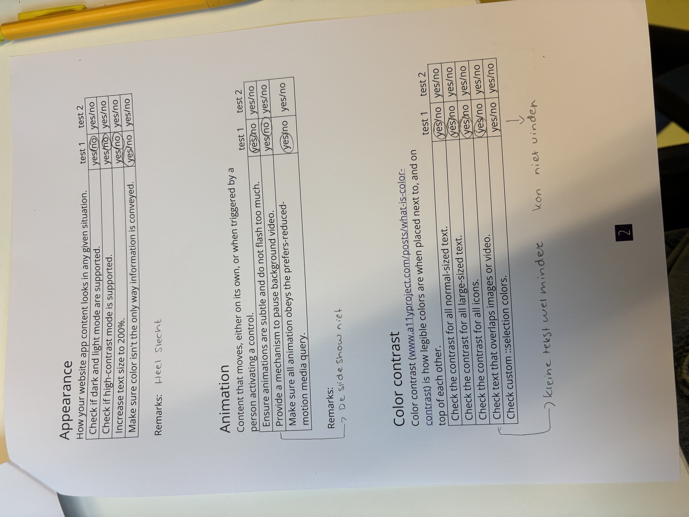

reflectie: 
Ik vond het best wel veel werk om in te vullen en sommige onderdelen van die WCAG checklist vond ik best wel lastig
te vinden. Maar ik snap het nut er wel van in.

Daarentegen vond ik die screenreader grappig om een keer mee gewerkt te hebben, maar ik vind
wel dat hij heel veel voorleest. Volgens mij zijn er ook veel meer functies waarbij je gerichter dingen kan
laten voorlezen, maar daar ben ik nog niet helemaal achter gekomen. 

## Breakdownschets (week 1)

  
uitwerken na afloop 3e werkgroep

  ### de hele pagina: 
  

  ### dynamisch deel (bijv menu): 
  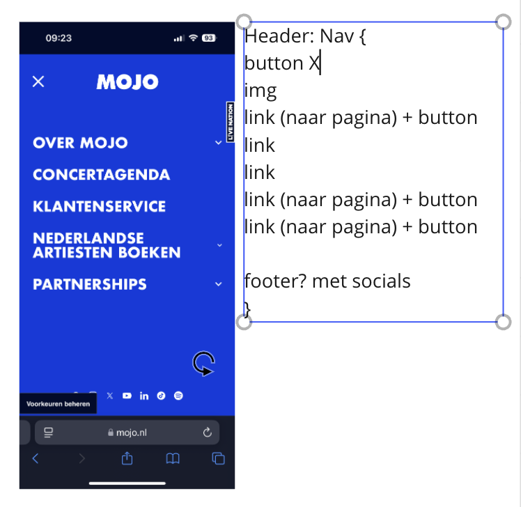

  ### wellicht nog een dynamisch deel (bijv filter): 
  

Reflectie: 
Dit vond ik wel een handige opgave om te doen, want zo heb je meteen een overzicht over hoe jouw html pagina
eruit moet komen te zien en dat is prettig. Soms vond ik het bij mojo best wel lastig om te benoemen of het logo nu 
een afbeelding is of een tekst. En de datum bij elke event nu een footer is of gewoon een p. 

## Voortgang 1 (week 2)

  
uitwerken voor 1e voortgang

  ### Stand van zaken
  hier dit ging goed & dit was lastig (neem ook screenshots op van delen van je website en code)

  Goed: de opdrachten die wij tijdens de les kregen over de verschillende onderwerpen gingen wel goed.

  Wat slechter:
  Toen ik mijn eigen html begon op te stellen was ik wat verward en wist ik sommige dingen niet meer goed terug te halen van vorig jaar. Zoals het gebruik van de ul en de sections, wanneer is het handig om dat te gebruiken. Zoals je hieronder kan zien zie je verschillende vlakken en in eerste instantie dacht ik dat dat allemaal sections waren, maar omdat het vaker terug komt en het lijkt ook op een lijst kon dat ook als een ul genoteerd worden.
 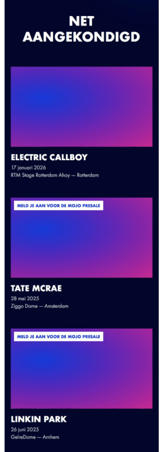

  Wat ik nu hiervoor heb gedaan is het volgende
   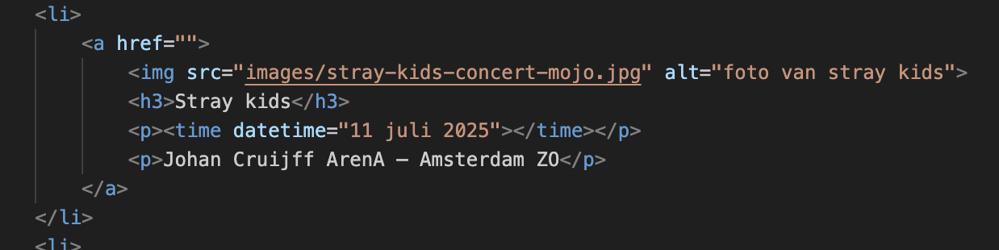
  Ik heb een li in de ul gezet met daarin de a want alle items daarin zijn klikbaar. Is dit de juiste manier om dit te doen?

  ### Agenda voor meeting
  samen met je groepje opstellen

  | Sabrina                            | Jeppe              | Rafi         | student 4        |
  | ---                                | ---                | ---          | ---              |
  | Ul/Sections                        | en dit             | Bronvermelden| en dan ik dat    |
  | H boven img?                       | dit als er tijd is | nog een punt | dit wil ik zeker |
  | Fieldset voor de from              | ...                | ...          | ...              |
  | links waar ik nu niks meer moet?   | ...                | ...          | ...              |
  | Bronvermelden hoe precies?         | ...                | ...          | ...    

  ### Verslag van meeting
  hier na afloop snel de uitkomsten van de meeting vastleggen

  - De bronnen voor de video's en imgs hoeven niet specifiek een bronvermelding bij, want het is voor een schoolopdracht.
  - Er mag geen H in de ul, dus die moet ik aanpassen naar een p en dan stijlen als een h
  - Om de fieldset hoeft geen article, want het is geen stuk tekst. Dus het kan zonder gebruikt worden, maar je kan er dus ook een ul van maken of een div gebruiken.
  - Van al die items met verschillende evenementen moet ik dus een ul gebruiken en daaromheen een section maken, want er staat wel gewoon een heading in.
  -  a>Hrefs die nergens naar lijden kan je leeg laten of een / erin zetten.
  - Voor de footer en de icons die je daar van de social media heb kan je beter de svg's gebruiken, daardoor kan je die ook makkelijker animeren.
  - als je video's wilt van youtube kan je de embed code kopieren van youtube erin zetten en dan heb je die te zien, vgm kan dit ook voor de spotify doen.
  - In de css eerst de algemene styling en daarna gewoon de pagina van boven naar beneden erin zetten.
  - Er moet een form om alle fieldsets heen

## Voortgang 2 (week 3)

  
uitwerken voor 2e voortgang

  ### Stand van zaken
In het begin had ik wat moeite met de flex methode, maar dat lukt nu wel aardig goed. Soms twijfel ik of code goed genoteerd staat zoals:
   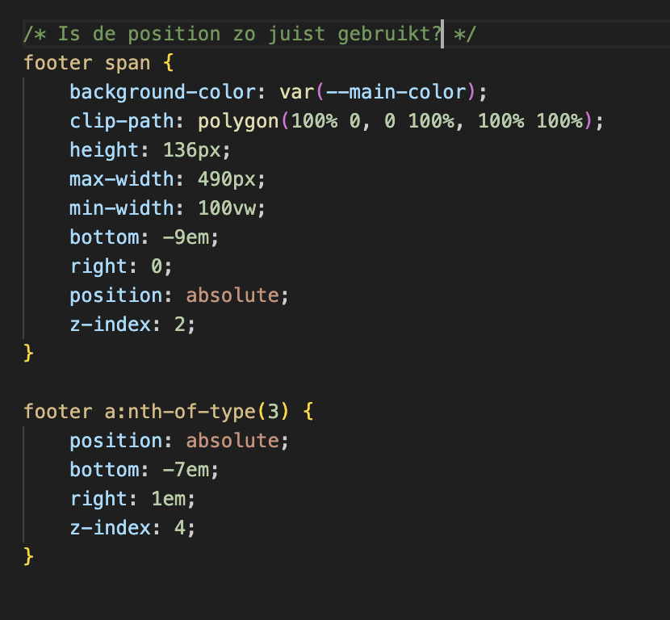
Ik heb namelijk gebruik gemaakt van een -X getal en ik weet niet of dit wel de juiste manier is om dat dan zo te noteren.
Verder loop ik tegen dingen aan die dan nog net te hoog gegrepen zijn, zoals bijvoorbeeld een slider met buttons. In plaats daarvan heb ik nu een afbeelding waarbij je kan scrollen naar rechts en weer terug.
Ik merk ook wel dat ik steeds beter begin te worden in het gebruiken van de selectoren, alhoewel ik wel vaak de :nth-of-type gebruik.

Als laatste heb ik moeite met mijn fieldset, daarbij heb ik een hover gemaakt, maar die werkt alleen op een klein gedeelte terwijl ik die over de hele breedte eigenlijk wil hebben net als de zoek. Zie hieronder het voorbeeld bij de, kies genre, button.
 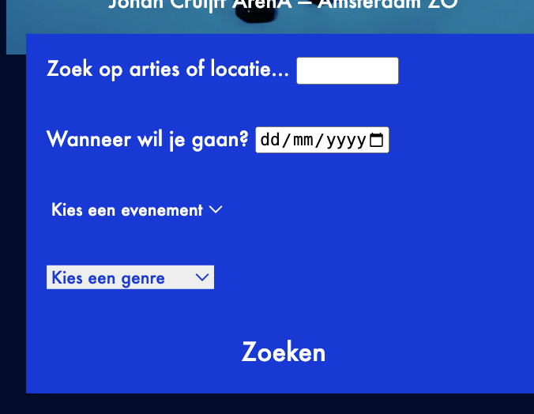

  ### Agenda voor meeting
  samen met je groepje opstellen

  |Sabrina                 | Jeppe              | Rafi                     | 
  | ---                    | ---                | ---                      | 
  | hover                  | ...                | loop atribute bij video  | 
  | position veel in de min| ...                | ...                      | 
  | vraagje over font      | ...                | ...                      | 
  | juiste opbouw css      | ...                | ...                      | 

  ### Verslag van meeting
  hier na afloop snel de uitkomsten van de meeting vastleggen

  - Bij de checkboxes kan je beter gebruik maken van de details met daarin label en dan daarin de summary, daar geef je dan aan wat zogezegd de titel is van het kopje die tevoorschijn komt in je viewport. In de label zet je dan de input met type checkbox. 
  - De fieldset is de section van een form
  - In een label gaat de for gepaard met de id waardoor je ook op de label kan klikken en dan kan je meteen al iets intypen in de input field.
-   Als je de header position fixed zet, dan komt de afbeelding achter de header te staan en blijft de header gewoon op zijn plek staan.
- Bij de footer en dan de span kan ik de bottom element in de css weg laten
- De h1 die ik heb staan moet de logo worden van de pagina, omdat de h1 niet Robbie Williams is.
- Maandag de opbouw van de css bespreken in de les.
- Je moet gewoon kijken wat je wilt leren en daar meer je aandacht op focussen, de docent gaat niet kijken of je alles een op een hebt weten na te maken van de website die jij hebt gekozen.
- Gebruik van een video kan je de breedte aanpassen door VW te gebruiken bij de width.
- Een fieldset heeft een legend nodig dat is de h van de fieldset, deze kan je ook hidden doen

## Toegankelijkheidstest 2/2 (week 4)

  
uitwerken na test in 9e werkgroep

  ### Bevindingen
  Lijst met je bevindingen die in de test naar voren kwamen (geef ook aan wat er verbeterd is):

  Verschillen: 
  Hieronder zie je alle afbeeldingen van de checklist die ik heb ingevuld. Er zijn heel wat dingen verbeterd, zo is de html beter gevalidate en hebben de heading levels een veel betere volgorde dan bij de orginele site. Daarnaast is er in deze site ook beter gebruik gemaakt van unordered lists. 

   
   
   
   
   
   
De directe link naar het mapje werkte voor de afbeelding niet, dus heb ik het zo met Hadil samen opgelost.

Daarnaast zijn er nog wel wat punten die verbeterd kunnen worden om de site toegankelijk te kunnen maken door bijvoorbeeld bij de video's wel een transcriptie te zetten, of dat aan te bieden door er een button te plaatsen. 

Ook heb ik gemerkt met de screenreader, dat zodra hij bij de iframe van de spotify is dat hij dan daar ook heading levels in heeft. Je mag maar 1 h1 in je pagina hebben, maar daar zit er dus ook een in. Plus met de screenreader gaat hij ook elk liedje langs met een h3 en een h4. Maar er zitten vijftig nummers in de lijst, dus je hoort dit vijftig keer. Dit is natuurlijk niet echt gebruiksvriendelijk en er is ook geen mogelijkheid om dit te skippen. 

Mijn stappen: 
Daarnaast kwam ik er ook achter dat het handig is om extra aria-labels toe te voegen aan lijstjes. Zo kan de schreen reader voorlezen wat voor een lijst zij voor zich hebben. Zie hieronder.
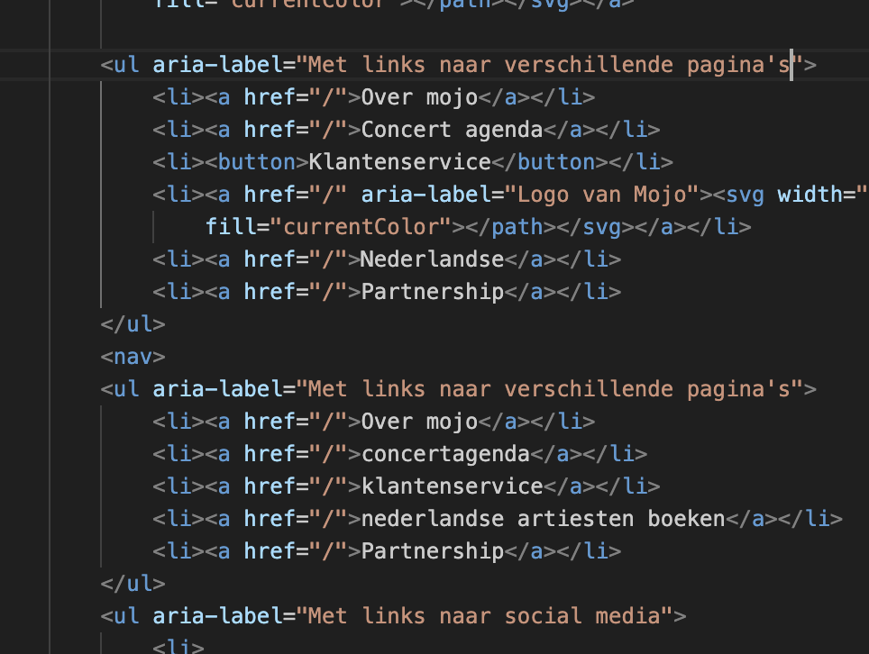

Voor de kwestie met de spotify lijst heb ik geprobeerd om een afspeellijst toe te voegen via youtube. Maar als ik dat doe krijg ik code van alleen dat nummer wat erin staat. Dus dat lukte niet.
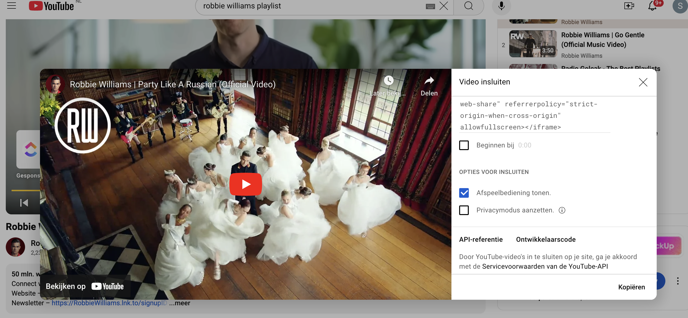

Ook werden de i frames niet duidelijk voorgelezen met de screenreader en voornamelijk de spotify lijst die werd overgeslagen, ik vermoed omdat het een link is, want daar liep ik tegen dat andere probleem aan. Dus ik heb bij die twee elementen een unieke aria-abel gegeven zodat ze goed worden voorgelezen met de sceenreader.
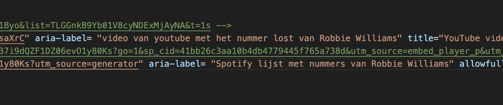

Aanbevelingen:
Voor de frame van spotify zou in de toekomst een skip link moeten maken, zodat je dat onderdeel kan overslaan. En je de rest van de content gewoon kan beluisteren.
Ook zou er eentje boven in de pagina bij de detailpagina, zodat ze meteen tickets kunnen kopen voor hun uitgekozen artiest. Anders moeten ze eerst door alle informatie gaan voordat ze eindelijk tickets kunnen bemachtigen. En met het kopen van tickets tellen die seconden, want bij de meeste ticketssales zijn de tickets al binnen een paar minuten uitverkocht (Dit weet ik uit uit ervaring).

Ook als mensen een transcriptie voor de video willen zou dat ook beschikbaar moeten zijn. Dit zou opgelost kunnen worden door een button te plaatsen. Alhoewel er in de video wel een button staat, maar deze kan je helemaal niet gebruiken.

Als ik voor surface plane had gekozen, zou ik een aantal buttons toevoegen om zo verschillende opties te bieden om de site nog toegangelijker te maken, zoals bijvoorbeeld een lichte interface inplaats van het donkerblauwe achtergrond wat er nu is. 

## Voortgang 3 (week 4)

  
uitwerken voor 3e voortgang

  ### Stand van zaken
  In de loop van deze week liep ik ineens tegen een probleem aan dat mijn justify content het niet meer deed, terwijl ik wel op de container een display flex had gezet. 
   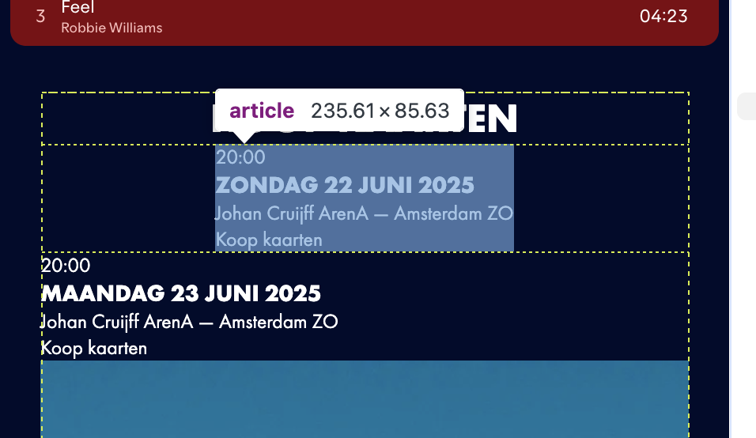
   Dit element wilde ik aan het begin plaatsen, maar op de een of andere manier wilde hij dat niet doen. 

   Daarnaast dat ik bezig was met het maken van de tweede pagina, kan je dan gewoon gebruik maken van de code die je hebt geschreven voor de eerste pagina en dan daarna de andere dingen los noteren, die je dan extra anders wilt hebben? Of moet je dan alles opnieuw herhalen? want anders wordt het niet echt overzichtelijk. 
    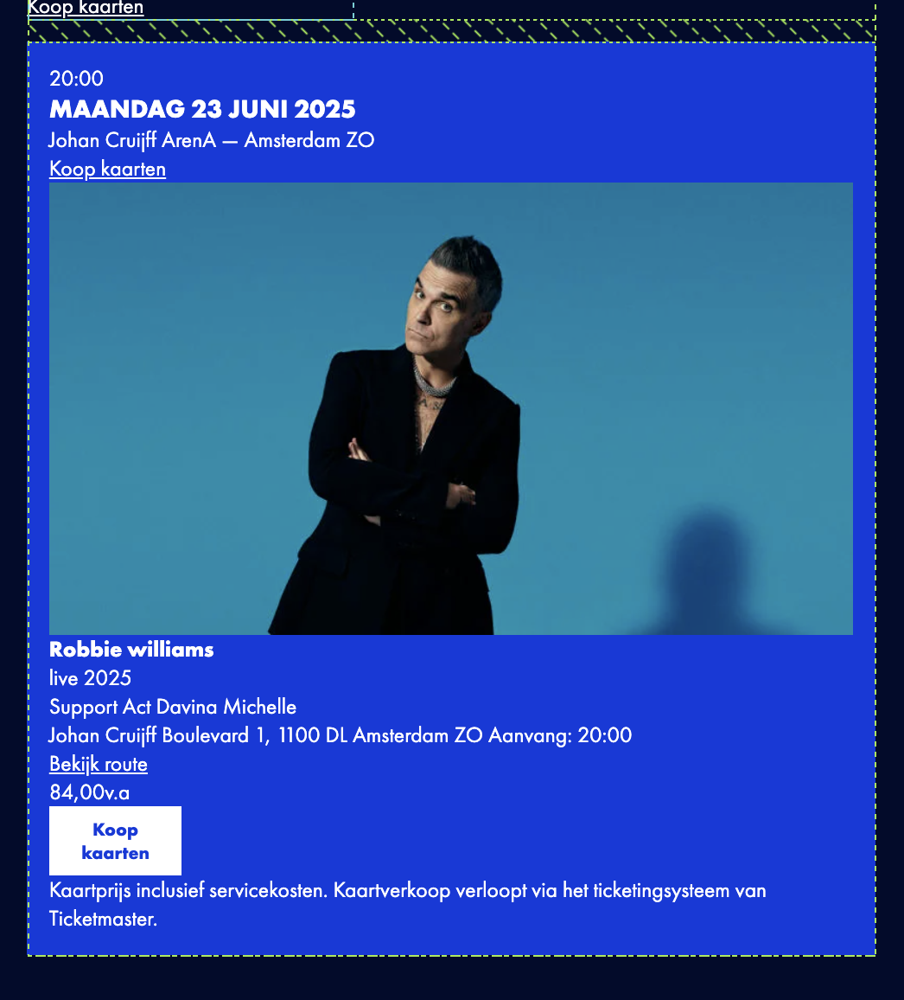

   Ook heb ik geprobeerd te experimenteren met de has() selector door in plaats van de header een gradient te geven dit te doen door wanneer je het genre disco aanvinkt dat het dan zou gebeuren, alleen op een een of ander manier lukte dit ook niet met de has() selector. Toen heb ik dit gevraagd aan wat ik fout had gedaan aan chatGpt, (https://chatgpt.com/c/67556c41-701c-8010-8380-a4dde9b285ba) met de prompt dit is mijn animatie wat doe ik fout of wat moet ik veranderen? Toen gaf die aan dat sommige browsers dit nog niet ondersteunde.

    Hieronder zie je een foto van de code in mijn css die ik had gezet alleen de selector was helemaal fout.
  
  
   Toch wilde ik niet opgeven en heb het ook nog een keer geprobeerd op het laatste moment en weer vragen gesteld aan chat waarom het niet werkte zie bron 22 voor de prompt. Ook nogmaals even goed lezen op mdn over de has() selector. En toen werkte het wel!!!!

   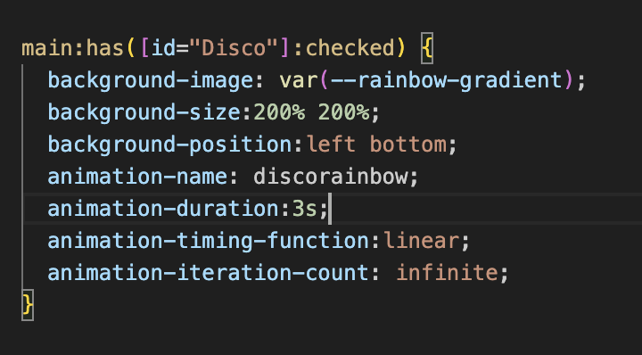

  En ik ben zo ontzettend trots hierop dat dit is gelukt.
   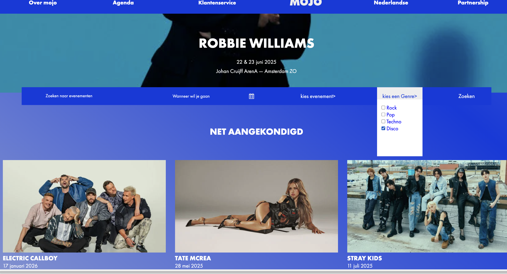

Voordat we het feedback gesprek hadden had ik niet heel veel vragen, want ik heb de bovenstaande problemen kunnen oplossen gedurende de week.
Daarnaast had ik enkel wat vragen over dit readMe bestand en heb deze ook gesteld.

  ### Agenda voor meeting
  samen met je groepje opstellen

  | Sabrina                                             | student 2          | student 3    | student 4        |
  | ---                                                 | ---                | ---          | ---              |
  | WCAG/Aanbeveling documentatie                       | en dit             | en ik dit    | en dan ik dat    |
  | Kan ik te veel regels css hebben                    | dit als er tijd is | nog een punt | dit wil ik zeker |
  | wat wordt er met karakteristieken bij eindgesprek   | ...                | ...          | ...              |

  ### Verslag van meeting
  hier na afloop snel de uitkomsten van de meeting vastleggen

  - Over die wcag de aanbeveling noteren. Maar eventueel een design ervoor in figma maken. Nog even navragen bij Vasilis. Je moet bij je aanbeveling alleen je inzichten noteren en wat niet is gelukt en wat wel.
  - 320px beginnen met responsive en telkens met 20em kijken of het nog klopt.
  - Karakeristieken?? In de readMe wat moet daar? Ook even vragen aan Vasilis. Je moet daar screenshots van je officiele pagina plaatsen.
  - Tabjes even naar kijken. Sneltoets formateren: cmd shift f.

## Eindgesprek (week 5)

  
uitwerken voor eindgesprek

  ### Je uitkomst - karakteristiek screenshots:
  Aan de linkerkant daar staat de gradient bij aan en de rechterkant zijn de pagina's normaal te zien.
  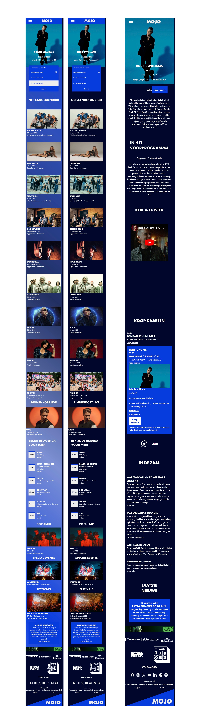

  ### Dit ging goed/Heb ik geleerd: 
  Tijdens dit blok heb ik ontzettend veel geleerd, ik heb geleerd hoe ik iets responsive moet maken, ik heb voor het eerst een grid gebruikt, maar ook position. Bovendien ben ik trots dat ik het zover heb geschopt met het na proberen te maken van de website. Wat wel goed ging was het schrijven van de html en de basis van de css.

  Ook heb ik, omdat ik het een leuk onderdeel vond om te leren een animatie erbij gevoegd, als je over de nav hovert dan komt er een bewegende gradient op de achtergrond te staan.
    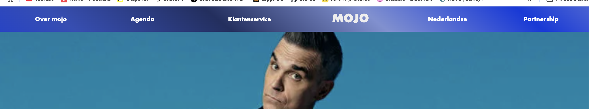

 Ook heb ik geleerd om de has() selector te gebruiken, en dat heeft bij mijn idee tot iets leuks geleidt. Ik moet zeggen dat ik in de vorige opdrachten met html/css nog nooit zoveel verschillende selectoren heb gebruikt. Dus ik heb heel veel nieuwe geleerd. 
   

  ### Dit was lastig/Is niet gelukt:
  Wat ik wel wat lastig vond was de tweede site stijlen, nadat ik de eerste had gedaan, omdat ik deels wel wat kon hergebruiken, maar ook heel veel niet en als ik dan iets aanpaste veranderde er ook weer iets anders. Daardoor had ik het idee alsof er gewoon geen einde aan kwam en ik die fouten steeds maar moest blijven aanpassen. 

  Zoals ik eerder al benoemd heb met de has() selector dit vond ik wel een lastig onderdeel, omdat ik het steeds niet goed neerzette als selector. 

## Bronnenlijst

  
continu bijhouden terwijl je werkt

  Nb. Wees specifiek ('css-tricks' als bron is bijv. niet specifiek genoeg). 
  Nb. ChatGpT en andere AI horen er ook bij.
  Nb. Vermeld de bronnen ook in je code.

Ik heb gedurende het blok ook hulp gehad bij sommige code van Hadil en Ali.
  1. https://www.mojo.nl/ Deze website ga ik namelijk namaken.
  2. https://developer.mozilla.org/en-US/docs/Web/HTML/Element/input 
  3. https://www.codecenter.nl/pr/tutorial/html/aflinks
  4. https://www.cdnfonts.com/futura-std-4.font 
  5. https://css-tricks.com/html-inputs-and-labels-a-love-story/
  6. https://www.w3schools.com/howto/howto_js_slideshow.asp 
  7. https://www.svgrepo.com/svg/35457/calendar-symbol 
  8. https://codehalweb.com/how-to-change-placeholder-color-in-html-and-css/#:~:text=Customizing%20placeholder%20text%20color%20in,%3A%3Aplaceholder%E2%80%9D%20pseudo%2Delement.&text=In%20this%20code%2C%20the%20%E2%80%9C%3A%3A,shade%20of%20gray%20(%23777). 
  9. https://developer.mozilla.org/en-US/docs/Web/CSS/object-position 
  10. https://codepen.io/Sabrina-z/pen/pvzzrev 
  11. https://cssgrid-generator.netlify.app/ 
  12. https://developer.mozilla.org/en-US/docs/Web/CSS/clip-path 
  13. https://www.codecenter.nl/pr/tutorial/html/aflinks
  14. https://validator.w3.org/nu/#textarea 
  15. https://chatgpt.com/c/6751764b-7658-8010-91c0-0972c8e5969e  met de prompt "Waarom heeft dit een foutcode"
  16. https://css-tricks.com/dynamic-dropdowns/ 
  17. zhttps://www.scottohara.me/blog/2020/05/02/labelled-lists.html  
  18. https://www.facebook.com/mojoconcerts/ 
  19. https://codepen.io/Sabrina-z/pen/emONMLK 
  20.  https://codepen.io/Sabrina-z/pen/ExqGXor 
  21. https://flukeout.github.io/ 
  22. https://chatgpt.com/c/67556c41-701c-8010-8380-a4dde9b285ba prompt: "Waarom werkt het niet?" + "ik wil dat als de label is gecheckt 
dat een ander element op het scherm gaat die gradient krijgt zoals de header nav" + "Kan dit ook zonder javascript"
  23. https://developer.mozilla.org/en-US/docs/Web/CSS/:has 

