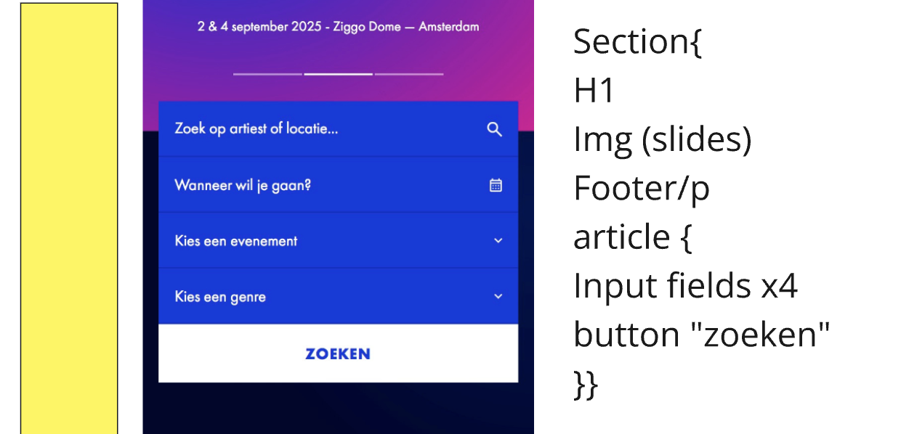

# Procesverslag
Markdown is een simpele manier om HTML te schrijven.  
Markdown cheat cheet: [Hulp bij het schrijven van Markdown](https://github.com/adam-p/markdown-here/wiki/Markdown-Cheatsheet).

Nb. De standaardstructuur en de spartaanse opmaak van de README.md zijn helemaal prima. Het gaat om de inhoud van je procesverslag. Besteedt de tijd voor pracht en praal aan je website.

Nb. Door *open* toe te voegen aan een *details* element kun je deze standaard open zetten. Fijn om dat steeds voor de relevante stuk(ken) te doen.

## Jij

  
uitwerken voor kick-off werkgroep

  ### Auteur:
  Sabrina Zuurbier

  #### Je startniveau:
  rode piste (kies uit zwart, rood óf blauw)

  #### Je focus:
  hier je focus (kies uit responsive óf surface plane)
  Mijn focus gaat denk ik meer zijn op het responsive gedeelte, maar om mijzelf een beetje uit te dagen met de code wil ik kijken/experimenteren of het lukt om een onderdeel uit de surface plane te kiezen.
 

## Je website

  
uitwerken voor kick-off werkgroep

  ### Je opdracht:
  link naar de website die je gaat namaken óf de naam/omschrijving van je eigen ontwerp
  De concerten website: Mojo
  Mojo link: https://www.mojo.nl/ 

  #### Screenshot(s) van de eerste pagina (small screen): 
  Homepagina van mojo (laptop)
  
  Homeoagina van mojo (telefoon)
 

  #### Screenshot(s) van de tweede pagina (small screen):
Detailpagina het evenement (laptop)
  

 vanaf de telefoon
   

## Toegankelijkheidstest 1/2 (week 1)

  
uitwerken na test in 2e werkgroep 2

  ### Bevindingen
 Bevindingen van crea de website van Maja: https://www.crea.nl/ 
 Bij een van de mogelijkheden bij november staan er pijltjes naar links en rechts die pakt hij helemaal niet.
 bij de dropdown menu krijg je geen optie om het te openen, na wat proberen moet je er alleen op enter klikken.
 Je moet wel weten wat level 3 heading betekent als je zo'n screenreader gebruikt.
 Je kan bij de evenementen krijg je niet de optie om erop te klikken, terwijl dit wel kan. Hij leest alleen de woorden voor.
 Hij benoemd de foto's niet.

 Bij mijn eigen site Mojo:
 -Soms slaat hij bepaalde dingen gewoon over. 
 -De ene keer pakt hij de images wel met de screenrecorder de andere keer niet.
 -Heel handig dat hij ook de tekst van de logo's voorleest. 
 -Wat praat het veel

 <bold> WCAG checklist </bold>
 
  
  
  
   
  

reflectie: 
Ik vond het best wel veel werk om in te vullen en sommige onderdelen van die WCAG checklist vond ik best wel lastig
te vinden. Maar ik snap het nut er wel van in.

Daarentegen vond ik die screenreader grappig om een keer mee gewerkt te hebben, maar ik vind
wel dat hij heel veel voorleest. Volgens mij zijn er ook veel meer functies waarbij je gerichter dingen kan
laten voorlezen, maar daar ben ik nog niet helemaal achter gekomen. 

## Breakdownschets (week 1)

  
uitwerken na afloop 3e werkgroep

  ### de hele pagina: 
  

  ### dynamisch deel (bijv menu): 
  

  ### wellicht nog een dynamisch deel (bijv filter): 
  

Reflectie: 
Dit vond ik wel een handige opgave om te doen, want zo heb je meteen een overzicht over hoe jouw html pagina
eruit moet komen te zien en dat is prettig. Soms vond ik het bij mojo best wel lastig om te benoemen of het logo nu 
een afbeelding is of een tekst. En de datum bij elke event nu een footer is of gewoon een p. 

## Voortgang 1 (week 2)

  
uitwerken voor 1e voortgang

  ### Stand van zaken
  hier dit ging goed & dit was lastig (neem ook screenshots op van delen van je website en code)

  Goed: de opdrachten die wij tijdens de les kregen over de verschillende onderwerpen gingen wel goed.

  Wat slechter:
  Toen ik mijn eigen html begon op te stellen was ik wat verward en wist ik sommige dingen niet meer goed terug te halen van vorig jaar. Zoals het gebruik van de ul en de sections, wanneer is het handig om dat te gebruiken. Zoals je hieronder kan zien zie je verschillende vlakken en in eerste instantie dacht ik dat dat allemaal sections waren, maar omdat het vaker terug komt en het lijkt ook op een lijst kon dat ook als een ul genoteerd worden.
 

  Wat ik nu hiervoor heb gedaan is het volgende
   
  Ik heb een li in de ul gezet met daarin de a want alle items daarin zijn klikbaar. Is dit de juiste manier om dit te doen?

  ### Agenda voor meeting
  samen met je groepje opstellen

  | Sabrina                            | Jeppe              | Rafi         | student 4        |
  | ---                                | ---                | ---          | ---              |
  | Ul/Sections                        | en dit             | Bronvermelden| en dan ik dat    |
  | H boven img?                       | dit als er tijd is | nog een punt | dit wil ik zeker |
  | Fieldset voor de from              | ...                | ...          | ...              |
  | links waar ik nu niks meer moet?   | ...                | ...          | ...              |
  | Bronvermelden hoe precies?         | ...                | ...          | ...    

  ### Verslag van meeting
  hier na afloop snel de uitkomsten van de meeting vastleggen

  - De bronnen voor de video's en imgs hoeven niet specifiek een bronvermelding bij, want het is voor een schoolopdracht.
  - Er mag geen H in de ul, dus die moet ik aanpassen naar een p en dan stijlen als een h
  - Om de fieldset hoeft geen article, want het is geen stuk tekst. Dus het kan zonder gebruikt worden, maar je kan er dus ook een ul van maken of een div gebruiken.
  - Van al die items met verschillende evenementen moet ik dus een ul gebruiken en daaromheen een section maken, want er staat wel gewoon een heading in.
  -  a>Hrefs die nergens naar lijden kan je leeg laten of een / erin zetten.
  - Voor de footer en de icons die je daar van de social media heb kan je beter de svg's gebruiken, daardoor kan je die ook makkelijker animeren.
  - als je video's wilt van youtube kan je de embed code kopieren van youtube erin zetten en dan heb je die te zien, vgm kan dit ook voor de spotify doen.
  - In de css eerst de algemene styling en daarna gewoon de pagina van boven naar beneden erin zetten.
  - Er moet een form om alle fieldsets heen

## Voortgang 2 (week 3)

  
uitwerken voor 2e voortgang

  ### Stand van zaken
In het begin had ik wat moeite met de flex methode, maar dat lukt nu wel aardig goed. Soms twijfel ik of code goed genoteerd staat zoals:
   
Ik heb namelijk gebruik gemaakt van een -X getal en ik weet niet of dit wel de juiste manier is om dat dan zo te noteren.
Verder loop ik tegen dingen aan die dan nog net te hoog gegrepen zijn, zoals bijvoorbeeld een slider met buttons. In plaats daarvan heb ik nu een afbeelding waarbij je kan scrollen naar rechts en weer terug.
Ik merk ook wel dat ik steeds beter begin te worden in het gebruiken van de selectoren, alhoewel ik wel vaak de :nth-of-type gebruik.

Als laatste heb ik moeite met mijn fieldset, daarbij heb ik een hover gemaakt, maar die werkt alleen op een klein gedeelte terwijl ik die over de hele breedte eigenlijk wil hebben net als de zoek. Zie hieronder het voorbeeld bij de, kies genre, button.
 

  ### Agenda voor meeting
  samen met je groepje opstellen

  |Sabrina                 | Jeppe              | Rafi                     | 
  | ---                    | ---                | ---                      | 
  | hover                  | ...                | loop atribute bij video  | 
  | position veel in de min| ...                | ...                      | 
  | vraagje over font      | ...                | ...                      | 
  | juiste opbouw css      | ...                | ...                      | 

  ### Verslag van meeting
  hier na afloop snel de uitkomsten van de meeting vastleggen

  - Bij de checkboxes kan je beter gebruik maken van de details met daarin label en dan daarin de summary, daar geef je dan aan wat zogezegd de titel is van het kopje die tevoorschijn komt in je viewport. In de label zet je dan de input met type checkbox. 
  - De fieldset is de section van een form
  - In een label gaat de for gepaard met de id waardoor je ook op de label kan klikken en dan kan je meteen al iets intypen in de input field.
-   Als je de header position fixed zet, dan komt de afbeelding achter de header te staan en blijft de header gewoon op zijn plek staan.
- Bij de footer en dan de span kan ik de bottom element in de css weg laten
- De h1 die ik heb staan moet de logo worden van de pagina, omdat de h1 niet Robbie Williams is.
- Maandag de opbouw van de css bespreken in de les.
- Je moet gewoon kijken wat je wilt leren en daar meer je aandacht op focussen, de docent gaat niet kijken of je alles een op een hebt weten na te maken van de website die jij hebt gekozen.
- Gebruik van een video kan je de breedte aanpassen door VW te gebruiken bij de width.
- Een fieldset heeft een legend nodig dat is de h van de fieldset, deze kan je ook hidden doen

## Toegankelijkheidstest 2/2 (week 4)

  
uitwerken na test in 9e werkgroep

  ### Bevindingen
  Lijst met je bevindingen die in de test naar voren kwamen (geef ook aan wat er verbeterd is):

## Voortgang 3 (week 4)

  
uitwerken voor 3e voortgang

  ### Stand van zaken
  hier dit ging goed & dit was lastig (neem ook screenshots op van delen van je website en code)

  ### Agenda voor meeting
  samen met je groepje opstellen

  | student 1      | student 2          | student 3    | student 4        |
  | ---            | ---                | ---          | ---              |
  | dit bespreken  | en dit             | en ik dit    | en dan ik dat    |
  | en dat ook nog | dit als er tijd is | nog een punt | dit wil ik zeker |
  | ...            | ...                | ...          | ...              |

  ### Verslag van meeting
  hier na afloop snel de uitkomsten van de meeting vastleggen

  - punt 1
  - punt 2
  - nog een punt
  - ...

## Eindgesprek (week 5)

  
uitwerken voor eindgesprek

  ### Je uitkomst - karakteristiek screenshots:
  

  ### Dit ging goed/Heb ik geleerd: 
  Korte omschrijving met plaatjes

  

  ### Dit was lastig/Is niet gelukt:
  Korte omschrijving met plaatjes

  

## Bronnenlijst

  
continu bijhouden terwijl je werkt

  Nb. Wees specifiek ('css-tricks' als bron is bijv. niet specifiek genoeg). 
  Nb. ChatGpT en andere AI horen er ook bij.
  Nb. Vermeld de bronnen ook in je code.

  1. https://www.mojo.nl/ Deze website ga ik namelijk namaken.
  2. https://developer.mozilla.org/en-US/docs/Web/HTML/Element/input 
  3. https://www.codecenter.nl/pr/tutorial/html/aflinks
  4. https://www.cdnfonts.com/futura-std-4.font 
  5. https://css-tricks.com/html-inputs-and-labels-a-love-story/
  6. https://www.w3schools.com/howto/howto_js_slideshow.asp 
  7. https://www.svgrepo.com/svg/35457/calendar-symbol 

