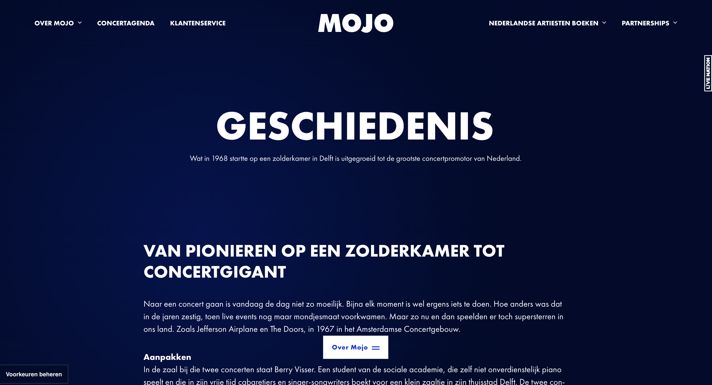
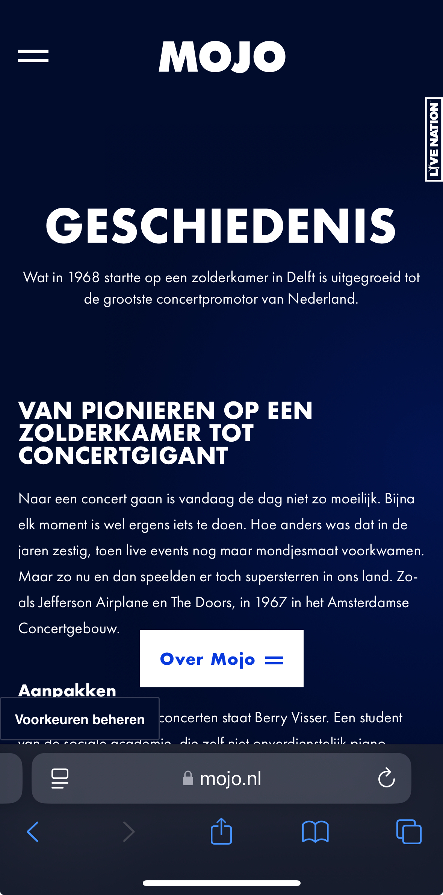

# Procesverslag
Markdown is een simpele manier om HTML te schrijven.  
Markdown cheat cheet: [Hulp bij het schrijven van Markdown](https://github.com/adam-p/markdown-here/wiki/Markdown-Cheatsheet).

Nb. De standaardstructuur en de spartaanse opmaak van de README.md zijn helemaal prima. Het gaat om de inhoud van je procesverslag. Besteedt de tijd voor pracht en praal aan je website.

Nb. Door *open* toe te voegen aan een *details* element kun je deze standaard open zetten. Fijn om dat steeds voor de relevante stuk(ken) te doen.

## Jij

  
uitwerken voor kick-off werkgroep

  ### Auteur:
  Sabrina Zuurbier

  #### Je startniveau:
  rode piste (kies uit zwart, rood óf blauw)

  #### Je focus:
  hier je focus (kies uit responsive óf surface plane)
  Mijn focus gaat denk ik meer zijn op het responsive gedeelte, maar om mijzelf een beetje uit te dagen met de code wil ik kijken/experimenteren of het lukt om een onderdeel uit de surface plane te kiezen.
 

## Je website

  
uitwerken voor kick-off werkgroep

  ### Je opdracht:
  link naar de website die je gaat namaken óf de naam/omschrijving van je eigen ontwerp
  De concerten website: Mojo
  Mojo link: https://www.mojo.nl/ 

  #### Screenshot(s) van de eerste pagina (small screen): 
  Homepagina van mojo (laptop)
  
  Homeoagina van mojo (telefoon)
 

  #### Screenshot(s) van de tweede pagina (small screen):
  Geschiedenis pagina van mojo (laptop)
  
  Geschiedenis pagina mojo (telefoon)
 

## Toegankelijkheidstest 1/2 (week 1)

  
uitwerken na test in 2e werkgroep 2

  ### Bevindingen
 Bevindingen van crea de website van Maja: https://www.crea.nl/ 
 Bij een van de mogelijkheden bij november staan er pijltjes naar links en rechts die pakt hij helemaal niet.
 bij de dropdown menu krijg je geen optie om het te openen, na wat proberen moet je er alleen op enter klikken.
 Je moet wel weten wat level 3 heading betekent als je zo'n screenreader gebruikt.
 Je kan bij de evenementen krijg je niet de optie om erop te klikken, terwijl dit wel kan. Hij leest alleen de woorden voor.
 Hij benoemd de foto's niet.

 Bij mijn eigen site Mojo:
 -Soms slaat hij bepaalde dingen gewoon over. 
 -De ene keer pakt hij de images wel met de screenrecorder de andere keer niet.
 -Heel handig dat hij ook de tekst van de logo's voorleest. 
 -Wat praat het veel

 <bold> WCAG checklist </bold>
 
  
  
  
   
  

reflectie: 

## Breakdownschets (week 1)

  
uitwerken na afloop 3e werkgroep

  ### de hele pagina: 
  

  ### dynamisch deel (bijv menu): 
  

  ### wellicht nog een dynamisch deel (bijv filter): 
  

## Voortgang 1 (week 2)

  
uitwerken voor 1e voortgang

  ### Stand van zaken
  hier dit ging goed & dit was lastig (neem ook screenshots op van delen van je website en code)

  ### Agenda voor meeting
  samen met je groepje opstellen

  | student 1      | student 2          | student 3    | student 4        |
  | ---            | ---                | ---          | ---              |
  | dit bespreken  | en dit             | en ik dit    | en dan ik dat    |
  | en dat ook nog | dit als er tijd is | nog een punt | dit wil ik zeker |
  | ...            | ...                | ...          | ...              |

  ### Verslag van meeting
  hier na afloop snel de uitkomsten van de meeting vastleggen

  - punt 1
  - punt 2
  - nog een punt
  - ...

## Voortgang 2 (week 3)

  
uitwerken voor 2e voortgang

  ### Stand van zaken
  hier dit ging goed & dit was lastig (neem ook screenshots op van delen van je website en code)

  ### Agenda voor meeting
  samen met je groepje opstellen

  | student 1      | student 2          | student 3    | student 4        |
  | ---            | ---                | ---          | ---              |
  | dit bespreken  | en dit             | en ik dit    | en dan ik dat    |
  | en dat ook nog | dit als er tijd is | nog een punt | dit wil ik zeker |
  | ...            | ...                | ...          | ...              |

  ### Verslag van meeting
  hier na afloop snel de uitkomsten van de meeting vastleggen

  - punt 1
  - punt 2
  - nog een punt
- ...

## Toegankelijkheidstest 2/2 (week 4)

  
uitwerken na test in 9e werkgroep

  ### Bevindingen
  Lijst met je bevindingen die in de test naar voren kwamen (geef ook aan wat er verbeterd is):

## Voortgang 3 (week 4)

  
uitwerken voor 3e voortgang

  ### Stand van zaken
  hier dit ging goed & dit was lastig (neem ook screenshots op van delen van je website en code)

  ### Agenda voor meeting
  samen met je groepje opstellen

  | student 1      | student 2          | student 3    | student 4        |
  | ---            | ---                | ---          | ---              |
  | dit bespreken  | en dit             | en ik dit    | en dan ik dat    |
  | en dat ook nog | dit als er tijd is | nog een punt | dit wil ik zeker |
  | ...            | ...                | ...          | ...              |

  ### Verslag van meeting
  hier na afloop snel de uitkomsten van de meeting vastleggen

  - punt 1
  - punt 2
  - nog een punt
  - ...

## Eindgesprek (week 5)

  
uitwerken voor eindgesprek

  ### Je uitkomst - karakteristiek screenshots:
  

  ### Dit ging goed/Heb ik geleerd: 
  Korte omschrijving met plaatjes

  

  ### Dit was lastig/Is niet gelukt:
  Korte omschrijving met plaatjes

  

## Bronnenlijst

  
continu bijhouden terwijl je werkt

  Nb. Wees specifiek ('css-tricks' als bron is bijv. niet specifiek genoeg). 
  Nb. ChatGpT en andere AI horen er ook bij.
  Nb. Vermeld de bronnen ook in je code.

  1. bron 1
  2. bron 2
  3. ...

